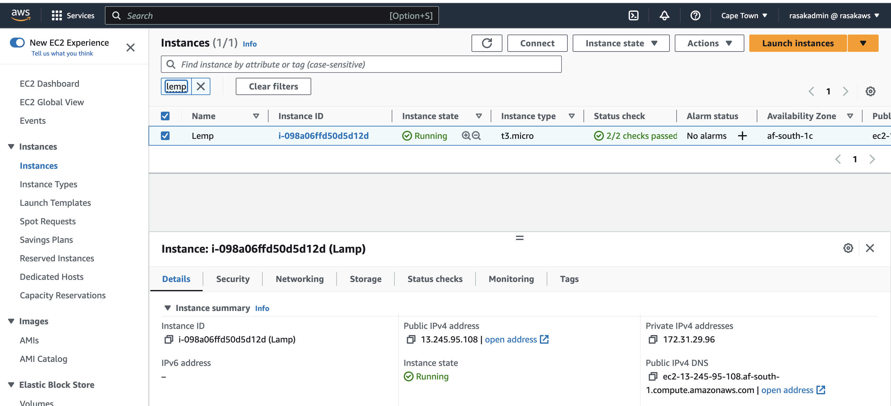
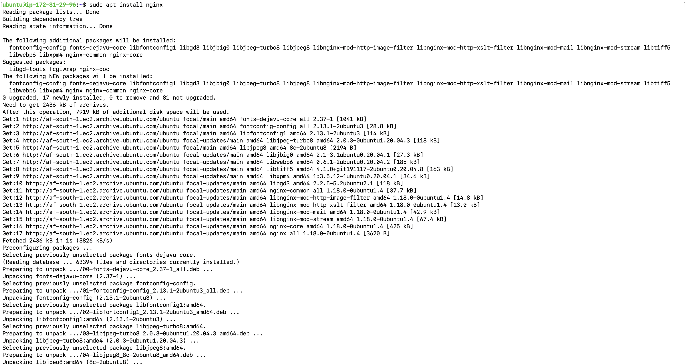
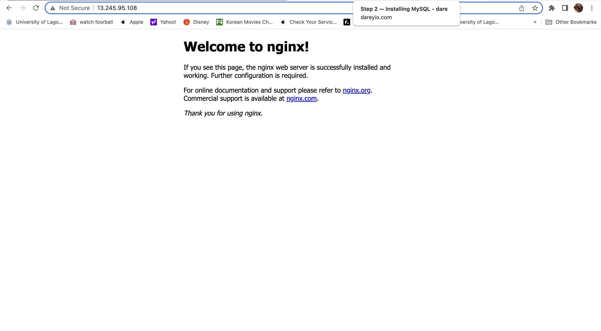

# LEMP STACK IMPLEMENTATION WITH AWS

## Prerequisites

EC2 instance on AWS with the following specification

> Instance ID : t2.micro
> Type : Ubuntu server 22.04 LTS (HVM)



## Installing The Nginx Web Server

1. Install Nginx and confirm the installation

```
#update the server's package index
sudo apt update

#install nginx
sudo apt install nginx

#verify the installation
sudo systemctl status nginx
```




2. Open port 80 so the webserver can receive traffic
   

3. Try to access the server locally

```
curl http://localhost:80
or
curl http://127.0.0.1:80
```


4. Try to access the server from your browser
   `http://<Public-IP-Address>:80`



## Installing MySQL

1. Use 'apt' to install the software

```
#install the sql server
sudo apt install mysql-server
```


2. Log into the console by running:
   `sudo mysql`

you should see this output

```
Welcome to the MySQL monitor.  Commands end with ; or \g.
Your MySQL connection id is 11
Server version: 8.0.30-0ubuntu0.20.04.2 (Ubuntu)

Copyright (c) 2000, 2022, Oracle and/or its affiliates.

Oracle is a registered trademark of Oracle Corporation and/or its
affiliates. Other names may be trademarks of their respective
owners.

Type 'help;' or '\h' for help. Type '\c' to clear the current input statement.

mysql>
```

The server is now installed and secure, you can exit the DB by typing 'exit'

## Installing PHP

We'll install PHP to process code and generate dynamic content for the webserver.
Nginx requires an external program to handle PHP processing and to act as a bridge between the PHP interpreter itself and the webserver.
You'll need to install php-fpmto tell Nginx to pass PHP requests to this software for processing and php-mysql, a PHP module that allows PHP to communicate with MySQL-based databases.

```
#install php-fpm
sudo apt install php-fpm

#install php-mysql
sudo apt install php-mysql
```


PHP components are installed.

## Configuring NGINX to use PHP processor

When using the Nginx webserver we can crete server blocks to encapsulate configuration details and host more than one domain on a single server, we will use 'projectlemp' as the example domain name here.
Nginx has one server block enabled by default and is configured to serve documents out of a directory at /var/www/html. We'll crete a directory within /var/www for the domain website, leaving /var/www/html. Reason being that it can become difficult to manage if we're hosting multiple sites. /var/www/html will be the default directory to be served if a client request does not match any other sites.

1. Crete a root web directory for your domain and assign ownership

```
#create directory
sudo mkdir /var/www/projectlemp

#assign ownership
sudo chown -R $USER:$USER /var/www/projectlemp
```

2. In Nginx 'sites-available' directory create a new configuration file
   `sudo nano /etc/nginx/sites-available/projectlemp'

paste in the following

```
#/etc/nginx/sites-available/projectlemp

server {
    listen 80;
    server_name projectlemp www.projectlemp;
    root /var/www/projectlemp;

    index index.html index.htm index.php;

    location / {
        try_files $uri $uri/ =404;
    }

    location ~ \.php$ {
        include snippets/fastcgi-php.conf;
        fastcgi_pass unix:/var/run/php/php8.1-fpm.sock;
     }

    location ~ /\.ht {
        deny all;
    }

}
```

3. Activate the configuration
   `sudo ln -s /etc/nginx/sites-available/projectlemp /etc/nginx/sites-enabled/`
   This will tell Nginx to use the configuration next time it is reloaded

```
#Disable default Nginx host that is currently configured to listen on port 80
sudo unlink /etc/nginx/sites-enabled/default

#reload Nginx to apply the changes:
sudo systemctl reload nginx
```

4. Create an html.index file in the /var/www/projectlemp location to test that the server block works.
   `sudo echo 'Hello LEMP from hostname' $(curl -s http://169.254.169.254/latest/meta-data/public-hostname) 'with public IP' $(curl -s http://169.254.169.254/latest/meta-data/public-ipv4) > /var/www/projectlemp/index.html`

5. Open the website URL using IP address from a browser
   `http://<Public-IP-Address>:80`
   

The index.html file take precedence over index.php, so rename or remove the index.html file.

## Testing PHP With Nginx

Testing to check if Nginx can give .php files to the PHP processor.

1. Create a test php file
   `sudo nano /var/www/projectlemp/info.php`

Contents of the file

```
<?php
phpinfo();
```

#access the page in your web browser
http://`server_domain_or_IP`/info.php

## Getting Data From The BD With MySQL

Creating a test database with a simple TO-DO list and configuring access to it , so the NGINX website would be able to query data from the DB and dispaly it.

1. create a test DB
   

2. Create a user and grant them full privileges on the DB

```
#create user
mysql> CREATE USER 'example_user'@'%' IDENTIFIED WITH mysql_native_password BY 'password';

#give full permission to the user
mysql> GRANT ALL ON example_database.* TO 'example_user'@'%';

#exit
mysql> exit

#Test if the new user has permission
mysql> mysql -u example_user -p
```


3. Confirm access to the database


4. Create a test table called 'list'

```
#creating the table
mysql> CREATE TABLE testDB.list (item_id INT AUTO_INCREMENT, content VARCHAR(255), PRIMARY KEY(item_id));

#adding content to the table
mysql> INSERT INTO testDB.list (content) VALUES ("My first important item");

#confirm the data was saved
mysql> SELECT * FROM testDB.list;

#quit mysql
mysql> exit
```


5. Create a PHP script that will connect to MySQL and query for the contents

```
#creating the script
/var/www/projectlemp$ sudo nano list.php

#content of the php file
<?php
$user = "example_user";
$password = "PassWord";
$database = "testdb";
$table = "list";

try {
  $db = new PDO("mysql:host=localhost;dbname=$database", $user, $password);
  echo "<h2>TODO</h2><ol>";
  foreach($db->query("SELECT content FROM $table") as $row) {
    echo "<li>" . $row['content'] . "</li>";
  }
  echo "</ol>";
} catch (PDOException $e) {
    print "Error!: " . $e->getMessage() . "<br/>";
    die();
}
```

6. Access the page from the web browser
   `http://<Public_domain_or_IP>/todo_list.php`
